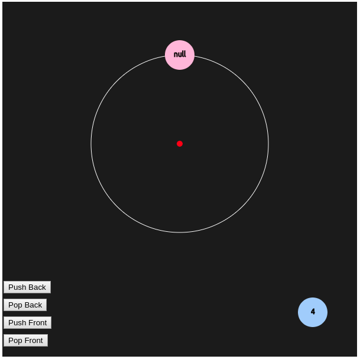
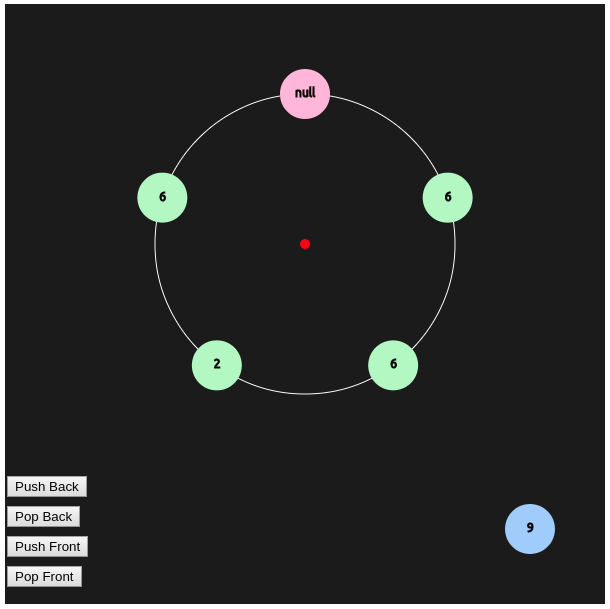

# circular-deque-visualizer
A simple circular deque visualizer made using P5 and Javascript

# overview and usage
This simple javascript visualizer shows how entries are inserted and deleted in a circular deque. For the record, a **deque** is a linear data structure which allows for insertion and deletion only on the two ends of the data structure. This visualizer shows how elements are internally linked inside the deque, with the pink `null` node used as a sentinel node.

Here is how the deque looks when first initialized:

To add or remove values to this deque, simply press the `Push Back`, `Pop Back`, `Push Front`, and `Pop Front`buttons to either add random elements or remove elements from this data structure.

Keep in mind that `Push Back` works by pushing elements in a **clockwise** fashion, and `Push Front` works by pushing elements in a **counterclockwise** fashion. In other words, `Back` refers to the space immediately to the **left** of the `null` sentinel node, and `Front` refers to the space immediately to the **right** of the data structure.

The **blue** circle in the bottom right corner indicates the random value which will next be inserted into this deque.

Experiment with pushing and popping elements to see how this data structure works! Here's what it looks like after several insertions and deletions of random elements:
